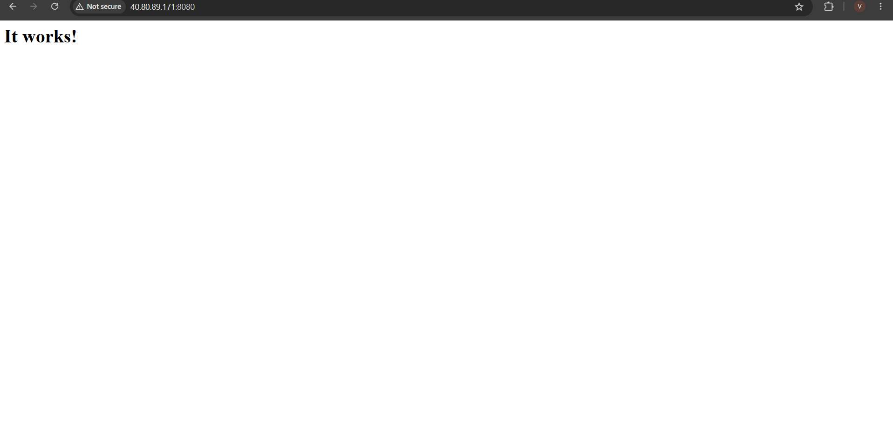

# Azure VM + Docker deployed with Terraform and an Azure DevOps pipeline

Terraform creates an Ubuntu 22.04 VM with Docker in an existing Azure resource group.
An Azure DevOps pipeline copies `app/compose.yaml` (httpd image) to the VM over SSH
and runs `docker compose up -d` on every push to `main`.

## Structure

```
.
├── app/compose.yaml            # httpd service, deployed by the pipeline
├── azure-pipelines.yml         # copy over SSH + docker compose up -d
├── scripts/show-vm-state.sh    # helper to show what is running on the VM
└── terraform/
    ├── main.tf / variables.tf / outputs.tf / providers.tf
    └── modules/
        ├── resource_group/     # reads the existing resource group
        ├── network/            # vnet, subnet, NSG (22, 8080-8090)
        └── compute/            # SSH key, public IP, NIC, VM, Docker via cloud-init
```

## How it works

1. `terraform apply` creates the network, the VM and an SSH key (`vm_key.pem`, not committed).
2. Azure DevOps has an SSH service connection named `vm-ssh` that uses that key.
3. A push to `main` that changes `app/` triggers the pipeline. It copies `compose.yaml`
   to `/opt/app` on the VM, then runs `docker compose pull` and `docker compose up -d`.

## Proof: change the compose file, push, see it applied

### Before: httpd 2.4.62 on port 8080



### Change

In `app/compose.yaml` I changed the image tag and the published port:

```yaml
image: httpd:<new-tag>
ports:
  - "8081:80"
```

I committed and pushed to `main`. The pipeline ran automatically.

### After: new image on port 8081


The pipeline log ended with `docker compose ps` showing the new image and
`0.0.0.0:8081->80/tcp`, followed by `HTTP/1.1 200 OK`.

## Usage

```bash
cd terraform
terraform init
terraform apply
```

Then create an SSH service connection called `vm-ssh` in Azure DevOps
(host = `public_ip` output, user = `azureuser`, private key = contents of `vm_key.pem`)
and create a pipeline from `azure-pipelines.yml`.

## Cleanup

```bash
cd terraform
terraform destroy
```
The existing resource group is not deleted.

## Security

`vm_key.pem`, `*.tfstate` and `.terraform/` are excluded by `.gitignore` and must never be committed.
